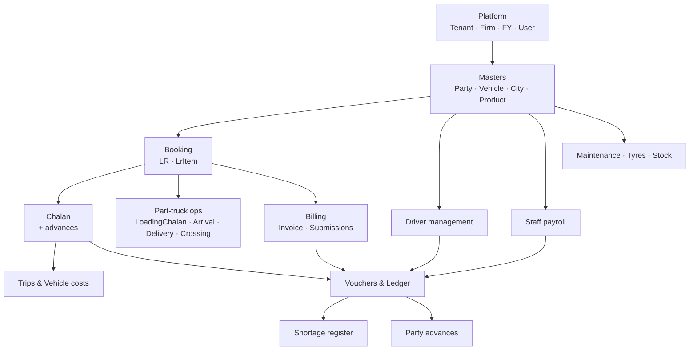
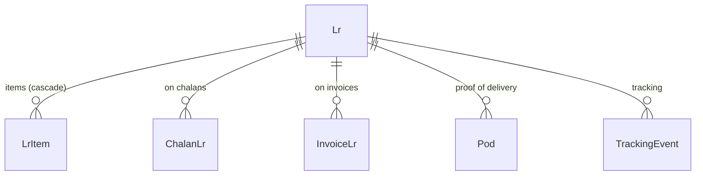
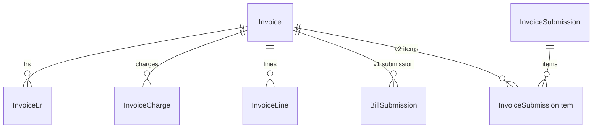
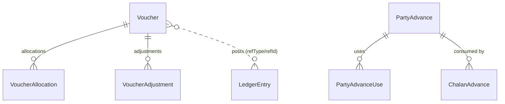
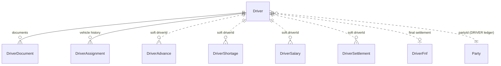

# Database Schema — Transport TMS

PostgreSQL (Neon) via Prisma. Source of truth: [prisma/schema.prisma](../prisma/schema.prisma).
72 models. Every business row carries `tenantId`; almost every document row also carries
`firmId` + `fyId` (financial year), and document numbers are unique per firm + FY.

---

## 1. How the schema is put together

Three conventions run through the whole database. Understanding them explains most
of the "where is the foreign key?" questions:

**1. Scoping columns, not scoping relations.** `tenantId`, `firmId` and `fyId` are plain
string columns on nearly every table. Only `Firm.tenantId` and `FinancialYear.firmId` are
declared as actual Prisma relations; elsewhere they are enforced by application code and
row-level security (see `prisma/migrations/20260704090000_rls`), not by FK constraints.

**2. Soft foreign keys.** Many links (`vehicleId`, `partyId`, `cityId`, `headId`,
`bankPartyId`, `driverId`, …) are stored as bare ids without a Prisma `@relation`. They are
still real references — they just aren't constrained at the DB level, which keeps deletes
and multi-tenant partitioning simple. In the tables below these are marked *soft*.

**3. `Party` is the universal counterparty.** There is no separate customer / supplier /
broker / staff table. Everything is a `Party` row distinguished by `ledgerGroup`
(BANK, CASH, CONSIGNEE_CONSIGNOR, DRIVER, EXPENSE, INCOME, OFFICE, OWNER_BROKER, RELATIVE,
STAFF, SUPPLIERS). A "bank account" is a Party in group BANK; a staff member is a Party in
group STAFF that also has a `StaffProfile`; a driver is a Party in group DRIVER that also
has a `Driver` row.

**4. `LedgerEntry` is the accounting spine.** No module posts to another module's tables.
Every money movement writes double-entry `LedgerEntry` rows tagged with
`refType` + `refId` + `refNo`. That polymorphic pair is how a chalan, an invoice, a salary
and a voucher all land in the same party ledger.

**5. Soft delete.** Documents carry `deletedAt`; rows are hidden, never removed. LR numbers
use a *partial* unique index (`WHERE "deletedAt" IS NULL`) so a deleted LR number can be reused.

---

## 2. Map of the modules

---

## 3. Platform & security

| Table | What it holds | Links |
|---|---|---|
| `Tenant` | Top-level customer account. `slug` unique. | → `User[]`, `Firm[]` |
| `Firm` | A billing entity inside a tenant: address, GSTIN, bank details, GST %, SMTP, and the logo/seal **stored as `Bytes` in the DB** (`logoData`/`sealData`, `brandingVersion` busts browser cache). | `tenantId` → Tenant; → `FinancialYear[]`, `UserFirm[]` |
| `FinancialYear` | e.g. "2026-2027" with start/end. Unique per `(firmId, label)`. | `firmId` → Firm |
| `User` | Login: `username` unique per tenant, `passwordHash`, `Role`. | `tenantId` → Tenant; → `UserFirm[]`, `UserPermission[]`, `AuditLog[]` |
| `UserFirm` | Which firms a user may switch into. Unique `(userId, firmId)`. | → User, Firm |
| `UserPermission` | Per-module CRUD/print/export flags. Unique `(userId, module)`. | → User |
| `DocumentSequence` | Next running number per `(firmId, fyId, docType)` for each `DocNumberType` (LR, CHALAN, VOUCHER_*, POD, TRIP, …). | soft: firm, FY |
| `AuditLog` | before/after JSON per entity change. | `userId` → User (optional) |

**Relationship shape:** `Tenant 1─* Firm 1─* FinancialYear`, and `User *─* Firm` through
`UserFirm`. Everything else hangs off a `(tenantId, firmId, fyId)` triple.

---

## 4. Masters

| Table | Notes | Links |
|---|---|---|
| `State` | Unique per tenant+name, has `gstCode`. | → `City[]` |
| `City` | Unique `(tenantId, name, stateId)`. | `stateId` → State |
| `Party` | The universal counterparty (see §1.3). Holds address, GSTIN/PAN/Aadhaar, opening balance + side, broker `tdsMode`, bank details, KYC document paths. Unique `(tenantId, name, ledgerGroup)` — the same name may exist in two groups. | → `Vehicle[]` as owner; referenced softly by nearly every document |
| `AccountHead` | Income/expense head. Unique per tenant+name. | soft-referenced by vouchers, office & vehicle expense |
| `ProductGroup` → `Product` | Product catalogue; `productType` NORMAL/ODC drives LR `cargoType`. | `Product.groupId` → ProductGroup |
| `Unit` | Named conversion values. | — |
| `Vehicle` | Number unique per tenant. `ownershipType` OWNER/BROKER/RELATIVE, `ownerNames` free text for own vehicles, plus RC/fitness/insurance/permit doc paths. | `ownerId` → Party (optional) |
| `RateMaster` | Contracted rate for `(party, product, source city, dest city)` with per-charge basis (rate/hamali/preBhada/dCharge/stationery/crossing, each with its own `RateBasis`). | soft: party, product, cities |
| `DocumentType` → `VehicleDocument` | Vehicle paper registry with expiry + reminder days. | `VehicleDocument.docTypeId` → DocumentType; `vehicleId` soft |
| `JobHead` | Maintenance job/service head with GST% + HSN. | used by `JobEntry.lines` JSON |

---

## 5. Booking — LR

`Lr` is the root document of the operational side.

`Lr` holds: numbering (`lrNo`, `refLrNo`, `isDummy`), route (`sourceCityId`, `destCityId`),
parties (`consignorId`, `consigneeId`, `billToId`), vehicle (`vehicleId` or free-text
`vehicleText` for dummy LRs), `LrType` (TO_PAY / TBB / PAID / FOC / CANCELLED /
PAPER_CHANGE), `LrStatus` (PENDING → ON_CHALAN → ARRIVED → DELIVERED → BILLED), insurance,
party invoice + e-way bill fields, and the full charge block (freight, hamali, preBhada,
bilty, collection, CPC, other, GST split, advance, grand total).

`LrItem` is the line detail: product, qty, actual/charge weight, rate + `RateBasis`,
received weight and shortage (wt/rate/amt), and L×W×H for ODC. Cascade-deletes with its LR.

**Uniqueness:** LR numbers are unique per firm + FY among non-deleted rows only
(partial index `Lr_firmId_fyId_lrNo_active_key`).

---

## 6. Freight chalan (full truck, to broker/owner)

| Table | Role |
|---|---|
| `Chalan` | Vehicle hire document: broker, vehicle, driver, route, weights and rate; the deduction block (detention, ODC, fine slip, LD, shortage, mamool, courier, commission %, TDS %, other); totals, `advanceTotal`, `balance`; trip KM (`startKm`, `unloadKm`, `runningKm`, `tripDays`); and the balance-payment lifecycle (`paymentStatus`, `balPaidAmount`, `balPaymentHeadId`, `balPaymentMode`, `balAdvanceAdjusted`). |
| `ChalanLr` | Join table Chalan ↔ LR. Unique `(chalanId, lrId)`, cascade from Chalan. |
| `ChalanAdvance` | Advances given against the chalan: `AdvanceType` (CASH/BANK/DIESEL/TOLL/TYRE/SPARE_PARTS/REPAIR/OTHER/**ADVANCE_ADJ**), diesel qty×rate, `bankPartyId` (posts to the bank book), `headId`. Rows of type ADVANCE_ADJ consume a `PartyAdvance` via `advanceId`. |

`Chalan *─* Lr` through `ChalanLr`; `Chalan 1─* ChalanAdvance`; `ChalanAdvance *─1 PartyAdvance`.

---

## 7. Part-truck operations

All of these are firm+FY-numbered standalone documents that reference masters softly.

| Table | Purpose |
|---|---|
| `LoadingChalan` | DIRECT or CROSSING loading sheet; the LRs it covers are an ordered id list in the `lrIds` JSON column (not a join table). Carries freight/commission/LC/DC/CF/crossing totals. |
| `Arrival` | Unloading record (`arrivalNo`, unload date, godown, manifest). |
| `Delivery` | GATE_PASS or CASH_MEMO delivery with pay type, cash/credit, delivery/gatepass/labour/AOC/damage charges. |
| `Crossing` | Inward crossing from another transporter: freight, crossing amount, DC %, to-pay/paid/TBB split, balance, `drCr`. |
| `OutwardCrossing` | Outward crossing; booking detail lines live in the `lines` JSON column. |
| `HireSlip` | Lorry hire slip: owner/broker/driver, weights, hire, loading/crane/unloading/over-height charges, less TDS/SC, advance, balance. |
| `SettlementSummary` | Part A / Part B settlement sheet with `extraLines` JSON. |

---

## 8. Billing

- **`Invoice`** — `InvoiceKind` PART_TRUCK / FULL_TRUCK / MANUAL / GST, unique
  `(firmId, fyId, kind, invoiceNo)`. Holds party, GST split (CGST/SGST/IGST %, amt), TDS,
  TCS, totals, advance, balance, and GST-invoice extras (place of supply, SAC code,
  reverse charge, transport mode).
- **`InvoiceLr`** — join to the LRs being billed (unique `(invoiceId, lrId)`, cascade).
- **`InvoiceCharge`** — extra charges (detention, waiting, late loading…) with the LRs they relate to.
- **`InvoiceLine`** — manual/GST line items with HSN, qty × rate, discount, per-line GST.
- **`BillSubmission`** — v1: one submission row per invoice.
- **`InvoiceSubmission` + `InvoiceSubmissionItem`** — v2: one submission covers many
  invoices, with acknowledgement fields and uploaded signed copies. When an invoice appears
  in a *later* submission, the earlier item flips to `RETURNED` and records
  `resubmittedInId` / `resubmittedInNo` / `resubmissionDate` — that's the return tracking.

---

## 9. Broker slip (two-sided)

`BrokerSlip` is a single row holding **both sides of a brokered load**, mirrored field for field:

- `p*` fields = party side (receivable): `partyId`, `pRate`, `pFreight`, deductions,
  `pTdsAmt`, `pCommAmt`, `pNetAmt`, `pAdvance`, `pBalance`, and a `pPaymentStatus`
  lifecycle for balance **received**.
- `v*` fields = owner/broker side (payable): `ownerId`, `vRate`, `vFreight`, … `vBalance`,
  with `vPaymentStatus` for balance **paid**.

Each side has its own `RateBasis` (`pRateBasis` / `vRateBasis`). Advances for both sides
live in the `advances` JSON column (tagged `side: 'P' | 'V'`), not in a child table. POD
upload fields and trip KM live here too.

---

## 10. Vouchers, adjustments & the ledger

| Table | Role |
|---|---|
| `Voucher` | RECEIPT / PAYMENT / CONTRA / JOURNAL, entry type CASH/BANK/CONTRA, `moduleLink` saying which module it belongs to, party and/or vehicle posting (`ledgerPosting` PARTY/VEHICLE/BOTH), cheque details, amount − TDS − deduction − other = `netAmount`. |
| `VoucherAllocation` | Which outstanding documents the voucher settles: `refType` (ModuleLink) + `refId` + `refNo`, bill amount, TDS, deduction (shortage), other, `roundOff` (may be negative), allocated `amount`. |
| `VoucherAdjustment` | The shared **adjustment engine** line: `adjustmentType` (TDS / SHORTAGE / DAMAGE / PENALTY / …) against `referenceType` + `referenceNo`, posted to `accountHeadId` so a deducted amount never stays outstanding. |
| `LedgerEntry` | The double-entry row: date, party and/or vehicle and/or account head, `side` DEBIT/CREDIT, amount, `refType`/`refId`/`refNo`, narration. Indexed by `(tenant, firm, fy, party, date)` for ledger reports and by `(tenant, refType, refId)` for drill-down and reversal. |
| `PartyAdvance` | Unallocated / over-paid money, RECEIVED or PAID, created by a voucher (`voucherId`) and consumed later. Balance = `amount − consumedAmount`. |
| `PartyAdvanceUse` | Each consumption, pointing at the document that used it. |

Editing history is immutable by convention: corrections reverse and re-post rather than mutate.

---

## 11. Office and vehicle expense vouchers

| Table | Role |
|---|---|
| `OfficeTransaction` | Office INCOME/EXPENSE with automatic double-entry: `headId` (AccountHead) ↔ `bankPartyId`, routed via `partyId` when a supplier is chosen. Blank `paymentMode` = on credit, settled later by a voucher. `refNo` is a free external reference echoed into every ledger row. |
| `VehicleExpenseVoucher` + `VehicleExpenseItem` | Same shape, but one voucher allocates across **many vehicles** (`items`, cascade). Relative-owned vehicle shares auto-transfer to the relative owner's ledger. Trip sheets only *fetch* from here. |
| `VehicleExpense` | Older flat per-vehicle expense row (category + amount + date), kept alongside the voucher model. |

---

## 12. Trips

| Table | Role |
|---|---|
| `Trip` | Trip sheet with going/return legs (`g*` / `r*` freight, hamali, diesel, driver advance, party advance, balance), AdBlue (urea) qty × rate, and the settlement block. `calcMethod` = DIESEL_AVG / FIXED / ACTUAL decides which inputs matter: KM readings + `dieselAvg`/`dieselAvg2` + `dieselRate`, or `fixedTripExp`, or actual operating expenses (`roadExp`, `otherOpExp`, `rtoExp`, fooding). Snapshots of fetched toll/diesel/advance are stored so a settled trip doesn't drift. `driverBalance` is the +/− pushed to `DriverSettlement`. |
| `TripExpense` | Per-trip expense lines by category (cascade from Trip). |
| `TripDoc` | Links a Chalan or Broker Slip to the one trip that settled it — `@@unique(tenantId, refType, refId)` makes "already settled" structurally impossible to duplicate. |

---

## 13. Driver management

- `Driver` — master with `driverCode` (DRV-0001), fixed document slots (licence, Aadhaar,
  PAN, photo, medical, police), join/exit dates, and `partyId` linking to a DRIVER-group
  Party so all money flows hit the normal ledger.
- `DriverDocument` / `DriverAssignment` — extra uploads and vehicle assignment history
  (both cascade from Driver).
- `DriverAdvance` — the source of truth for trip sheets; flips PENDING → ADJUSTED with
  `tripId` when a trip consumes it.
- `DriverShortage` — shortage against a driver, with partial `adjustedAmount` and the
  `salaryId` that recovered it.
- `DriverSalary` — monthly, unique `(firmId, fyId, driverId, month)`, with advance and
  shortage deductions and partial `paidAmount`.
- `DriverSettlement` — the +/− register, one per trip (`@@unique(tenantId, tripId)`);
  positive = company pays driver. Records the auto-created voucher.
- `DriverFnf` — one-time full & final: running salary, shortage/advance/negative-balance
  adjustments, final payable.

---

## 14. Staff payroll

Staff are Party rows (`ledgerGroup = STAFF`); these tables add the employment layer.

| Table | Role |
|---|---|
| `StaffProfile` | 1─1 with a Party (`partyId @unique`): employee id, department, designation, joining date, basic + allowances. |
| `StaffAdvance` | SADV-numbered advance paid from a bank/cash head. |
| `StaffLoan` | SLN-numbered loan with EMI; auto-CLOSED when fully recovered. |
| `StaffSalary` | Monthly, unique `(firmId, fyId, partyId, month)`. Earnings block, deductions block, and recovery links to one `advanceId` and one `loanId`; gross → deductions → net; payment status + head. |

---

## 15. Shortage register

One register for every shortage regardless of which module raised it.

- `ShortageEntry` — `module` (CHALAN / BROKER_SLIP / DRIVER / VOUCHER / MANUAL), the raising
  document (`refId`/`refNo`), who is answerable (**exactly one** of `partyId` / `driverId`,
  plus `partyKind`), `amount` vs `recoveredAmount`. `autoRaised` marks entries created only
  to absorb a recovery with nothing open to match — the shortage ledger skips those.
- `ShortageRecovery` — each recovery (cascade), recording the recovering module, the source
  (DRIVER / OWNER / BROKER / PARTY / BANK) and who it was recovered *from*, which may differ
  from the entry's own party.

Pending = `amount − recoveredAmount`, answerable in one query across all modules.

---

## 16. POD, tracking, maintenance, stock, misc

| Table | Role |
|---|---|
| `Pod` | Proof of delivery, `PodSourceType` BOOKING / OUTWARD_CROSSING / CROSSING_CHALLAN / GATE_PASS / BROKER_SLIP. Optional real relation to `Lr`; otherwise identified by `refNo`. Carries actual/received/shortage weight and the uploaded file. |
| `TrackingEvent` | Location/status timeline, optionally linked to an `Lr`. |
| `VehicleTracking` | Live register: one auto-saved snapshot per `(firm, vehicle, day)`; latest row = current status. Only the last 120 days are retained. |
| `JobInfo` | Garage job card (vehicle + garage party + status). |
| `JobEntry` | Maintenance invoice; line items in `lines` JSON referencing `JobHead`; service reminder by KM or days. |
| `Purchase` | PURCHASE or TYRE_SCRAP invoice with `lines` JSON, warranty and KM readings. |
| `Tyre` + `TyreCycle` | A tyre is a permanent identity (`tyreNo` unique per firm); its life is a series of cycles (vehicle, position HORSE/TRAILER, install/removal KM & date). A transfer closes one cycle and opens the next; total life = sum of cycles. |
| `TyreInstallation` | Older/simpler install record kept alongside `TyreCycle`. |
| `AdblueTxn` | Litre-only urea stock: REFILL / ISSUE. No accounting — value is computed inside the trip sheet from a manually entered rate. |
| `OpeningStock`, `StationeryStock` | Opening inventory and LR-book inward/issue register. |
| `CourierDispatch` + `CourierDispatchItem` | Deliberately unlinked manual dispatch register (courier company, party and vehicle number are free text); one dispatch holds many document rows, searchable by vehicle number. |
| `SavedFilter` | Per-user saved report filters, unique `(userId, screen, name)`. |

---

## 17. Enum reference

| Enum | Values |
|---|---|
| `Role` | OWNER, ADMIN, OPERATOR, ACCOUNTANT, VIEWER |
| `LedgerGroup` | BANK, CASH, CONSIGNEE_CONSIGNOR, DRIVER, EXPENSE, INCOME, OFFICE, OWNER_BROKER, RELATIVE, STAFF, SUPPLIERS |
| `LrType` | TO_PAY, TBB, PAID, FOC, CANCELLED, PAPER_CHANGE |
| `LrStatus` | PENDING, ON_CHALAN, ARRIVED, DELIVERED, BILLED |
| `RateBasis` | QTY, ACTUAL_WT, CHARGE_WT, FIXED |
| `VoucherType` | RECEIPT, PAYMENT, CONTRA, JOURNAL |
| `VoucherEntryType` | CASH, BANK, CONTRA |
| `ModuleLink` | BILLING, LORRY_HIRE, BROKER_ENTRY, FREIGHT_CHALLAN, CASH_MEMO, GST_BILLING, LR_ENTRY, OTHERS |
| `AdvanceType` | CASH, BANK, DIESEL, TOLL, TYRE, SPARE_PARTS, REPAIR, OTHER, ADVANCE_ADJ |
| `PodSourceType` | BOOKING, OUTWARD_CROSSING, CROSSING_CHALLAN, GATE_PASS, BROKER_SLIP |
| `DeliveryType` | GATE_PASS, CASH_MEMO |
| `CashCredit` | CASH, CREDIT |
| `LoadingChalanType` | DIRECT, CROSSING |
| `InvoiceKind` | PART_TRUCK, FULL_TRUCK, MANUAL, GST |
| `TdsMode` | TDS_APPLICABLE, DECLARATION |
| `TripLeg` | GOING, RETURN |
| `EntrySide` | DEBIT, CREDIT |
| `DocNumberType` | LR, CHALAN, LOADING_CHALAN, ARRIVAL, DELIVERY, CROSSING, OUTWARD_CROSSING, HIRE_SLIP, SUMMARY, VOUCHER_RECEIPT, VOUCHER_PAYMENT, VOUCHER_CONTRA, VOUCHER_JOURNAL, POD, BROKER_SLIP, BROKER_BILL, TRIP, JOB_ENTRY, PURCHASE, CASH_REPORT |

---

## 18. Cascade deletes

These children are removed with their parent (`onDelete: Cascade`):
`LrItem`, `ChalanLr`, `ChalanAdvance`, `InvoiceLr`, `InvoiceCharge`, `InvoiceLine`,
`InvoiceSubmissionItem`, `VoucherAllocation`, `VoucherAdjustment`, `TripExpense`,
`CourierDispatchItem`, `TyreCycle`, `DriverDocument`, `DriverAssignment`,
`ShortageRecovery`, `VehicleExpenseItem`, `PartyAdvanceUse`.

Everything else is soft-deleted via `deletedAt`.

---

## 19. Data stored as JSON rather than child tables

Worth knowing, because these are invisible to relational queries:

| Column | Contents |
|---|---|
| `LoadingChalan.lrIds` | ordered LR id list |
| `OutwardCrossing.lines` | booking detail lines |
| `SettlementSummary.extraLines` | `{side: 'A'\|'B', name, value}` |
| `BrokerSlip.advances` | `{side: 'P'\|'V', type, amount, …}` |
| `JobEntry.lines`, `Purchase.lines` | invoice line items |
| `AuditLog.before` / `.after` | change snapshots |
| `SavedFilter.params` | filter state |
